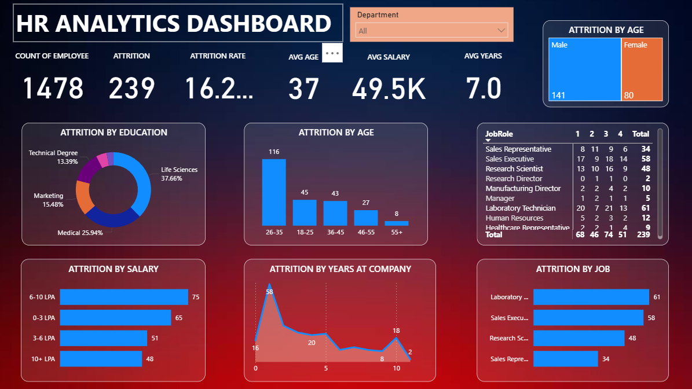

# HR Attrition Analytics Dashboard

An interactive Power BI dashboard analyzing employee attrition patterns
across department, age, salary band, tenure, and job role.

> Built by following a Power BI tutorial to practice DAX, matrix visuals,
> and dashboard design for HR/people analytics use cases.

## What This Dashboard Shows

**Key metrics**
- Count of Employees, Attrition count, Attrition Rate, Average Age,
  Average Salary, and Average Years at Company as headline KPIs
- Department filter for drilling into specific teams

**Attrition breakdowns**
- By age group (highest attrition in the 26–35 bracket)
- By education field (donut chart across Life Sciences, Medical,
  Marketing, Technical Degree)
- By salary band (0–3 LPA through 10+ LPA)
- By years at company (line/area chart showing attrition risk over tenure)
- By job role, with a matrix table cross-tabulating role against a
  performance/rating scale

**Segmentation**
- Attrition by age and gender (treemap comparing Male vs. Female)
- Attrition by job role, ranked

## Tools Used

Power BI · DAX

## How to View

1. Download the `.pbix` file from this repository
2. Open in Power BI Desktop (free) to interact with the filters

## Dataset

HR employee attrition dataset covering demographics, compensation,
tenure, department, and job role.
